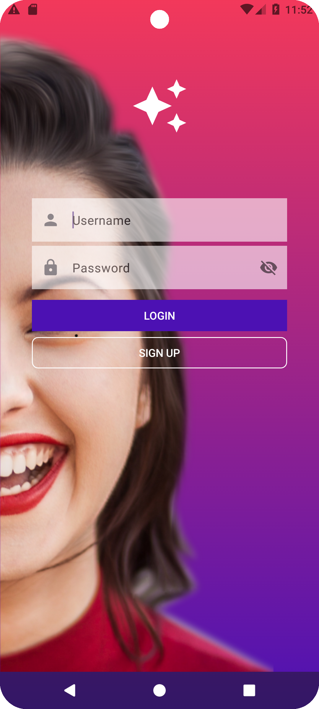
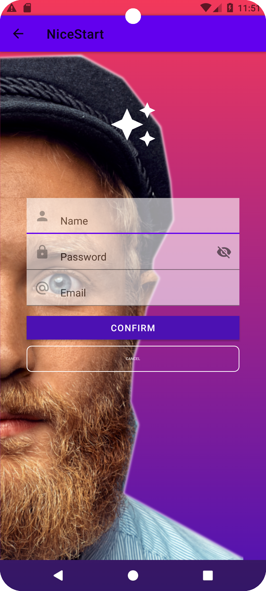
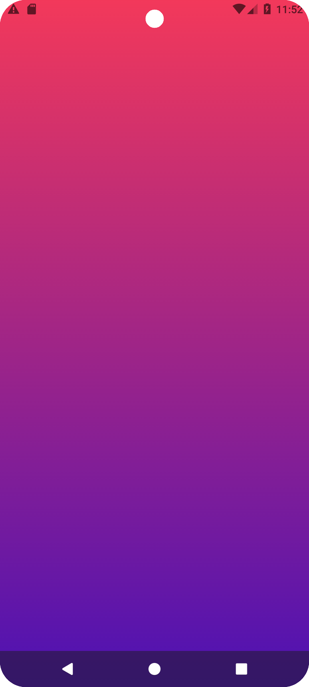

# Proyecto De Interfaces

## Primer proyecto 

En este repositorio se manejan dos ramas la *master* y la *hotflix*. Y ahora cuenta con 5 actividades.

Las tres actividades anteriores eran el **Login**, el **Sign Up** y el **Main**.
Ahora cuenta con dos actividades más el **Profile** y el **Splash**.

Ahora al abrir la aplicación nos saldrá el Activity Splash, ya que la animación principal de la aplicación.
### SPLASH:

Cuenta con tres animaciones,dos para el icono de la app y uno para el texto y el icono.
La primera es de de zoom, es la que tiene el texto y el icono.

    <scale
    android:duration="3050"
    android:fillAfter="true"
    android:fromXScale="0"
    android:toXScale="2"
    android:fromYScale="0"
    android:toYScale="2"
    android:pivotX="50%"
    android:pivotY="50%" />

La segunda es la de giro que la tiene el icono :

    <rotate
    android:duration="3000"
    android:fillAfter="true"
    android:fromDegrees="0"
    android:pivotX="50%"
    android:pivotY="50%"
    android:toDegrees="360"/>

Y la ultima que es la de traslado :

    <translate
    android:duration="3000"
    android:fillAfter="true"
    android:fromXDelta="0"
    android:toXDelta="100"
    android:fromYDelta="0"
    android:toYDelta="600" />

Estas animaciones generan que la ventana de apertura de la app sea más dinámica.

### LOGIN:

Se consigue relacionar con **SignUp** mediante el siguiente código:

**En el Login.java :**

    public void openSignup(View view) {
        Intent intent = new Intent(Login.this, SignUp.class);
        startActivity(intent);
    }

**Y en el activity_login.xml :**

     <Button
        android:id="@+id/signup"
        android:text="SIGN UP"
        android:onClick="openSignup" <!--Desde aqui se llama al metodo para que
                                        al presionar el boton te mande a Sign Up-->
        app:cornerRadius="8dp"
        app:layout_constraintEnd_toEndOf="@id/guideline5"
        app:layout_constraintStart_toStartOf="@+id/guideline4"
        app:layout_constraintTop_toBottomOf="@id/login"
        style="@style/buttonStyle">
    </Button>

También se relacionan **Login** y **Main** por un codigo similar :

**En el Login.java :**

    public void openMain(View view) {
        Intent intent = new Intent(Login.this, Main.class);
        startActivity(intent);
    }

**Y en el activity_login.xml :**

        android:onClick="openMain"

### SIGN UP:

El SignUp cuenta con dos botones, *Confirm* y *Cancel* .El primero te mandara al **Main** y el segundo al **Login**
El código es el siguiente:

**Para ir al Login**

*SignUp.java*
        
    public void returnLogin(View view) {
        Intent intent = new Intent(SignUp.this, Login.class);
        startActivity(intent);
    }
    
*activity_signup.xml*
    
    android:id="@+id/cancelar"
    android:text="@string/cancel"
    android:onClick="returnLogin"

**Para ir al Main**

*SignUp.java*

     public void returnMain(View view) {
        Intent intent = new Intent(SignUp.this, Main.class);
        startActivity(intent);
    }

*activity_signup.xml*

    android:id="@+id/confirm"
    android:text="CONFIRM"
    app:cornerRadius="0dp"
    android:onClick="returnMain"

### MAIN:

